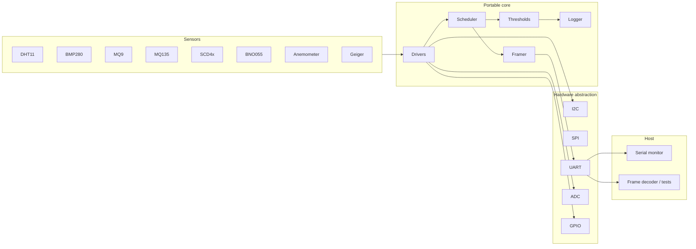

# Mission-grade habitat IoT

Firmware for multi-sensor environmental monitoring in analog-astronaut /
mission-simulated habitats (AAKA Space). One ESP32 image per node, shared
portable core, UART telemetry with CRC-framed backups.

This repository replaces an earlier set of unversioned Arduino sketches.
Those sketches mixed Wi-Fi credentials into source. **Rotate any network
keys that were ever committed on `main`.** This tree does not contain
credentials.

## Architecture



The scheduler is tick-based. `loop()` never calls `delay()` for sampling.
DHT11 still needs a multi-millisecond bit-bang window when it is read; that
is the only blocking section, and it is confined to that driver.

## Nodes and protocols

| Env                   | Node              | Sensors                    | Bus      |
|-----------------------|-------------------|----------------------------|----------|
| `external_weather`    | external weather  | DHT11, BMP280              | 1-wire, I2C |
| `external_radiation`  | external radiation| anemometer, Geiger         | ADC, GPIO |
| `internal_air`        | internal air      | MQ-9, MQ-135, BMP280       | ADC, I2C |
| `internal_imu`        | internal IMU      | BNO055                     | I2C |
| `internal_co2`        | internal CO2      | SCD4x, DHT11               | I2C, 1-wire |

Thresholds, hysteresis, and debounce live in `firmware/include/habitat/config.h`.
They are design targets for a shirt-sleeve analog habitat, not certified
flight limits.

## Repository layout

```
firmware/           PlatformIO project (ESP32 / Arduino)
  include/habitat/  Public headers (types, HAL, drivers, protocol)
  src/core/         Scheduler, alerts, framing, telemetry, logging
  src/algo/         Host-testable conversions (BMP280, DHT11, MQ, ...)
  src/drivers/      Register-level drivers over the HAL
  src/hal/          ESP32 implementation of the HAL
  src/main.cpp      Node bring-up and non-blocking loop
tests/              Host unit tests (no hardware)
docs/               Hardware, BOM, on-wire protocol
.github/workflows/  Lint + tests + firmware compile
```

## Build, flash, run

Install [PlatformIO Core](https://docs.platformio.org/en/latest/core/installation.html).

```bash
# compile the default weather node
pio run -d firmware -e external_weather

# flash and open the UART monitor (115200)
pio run -d firmware -e external_weather -t upload -t monitor
```

Replace the env name with `external_radiation`, `internal_air`,
`internal_imu`, or `internal_co2` to match the board on the desk.

Host tests (no ESP32 required):

```bash
make -C tests
```

`clang-format` is the C++ style gate. CI runs it with `--dry-run --Werror`.

## Telemetry

UART 115200 8N1. Each sample period prints a key=value line and the same
bytes inside a `0xA5 0x5A` frame with CRC-16/CCITT-FALSE. Alerts are a
separate line plus frame when a channel changes severity after debounce.

Example:

```
node=external_weather ts=12000 seq=3 worst=ok temp_c=22.50 humidity_rh=41.00 pressure_hpa=1006.53
```

See [docs/protocol.md](docs/protocol.md) for the binary layout.

## Bill of materials

[docs/bom.md](docs/bom.md) and the pin map in [docs/hardware.md](docs/hardware.md).

## What this is not

- Not a flight computer. No watchdogs, no redundant buses, no radiation
  hardening, no time sync, no authenticated uplink.
- MQ-9 / MQ-135 values are raw 12-bit ADC counts. They are not ppm. A
  clean-air Ro calibration is required before any gas concentration claim.
- DHT11 is a hobby-grade part (±2 °C, coarse RH). Use it as a cross-check
  against BMP280 / SCD4x, not as the science sensor.
- The Geiger dose conversion (`0.0057 µSv/h` per CPM) is the factor used on
  the existing habitat tubes. It is tube-specific.
- No Wi-Fi or MQTT in this firmware. The previous sketches published to a
  broker with secrets in source. UART is the interface; a host process can
  forward frames if you need a network hop.
- Host tests cover protocol, thresholds, conversions, and drivers against a
  mocked I2C/ADC HAL. They do not prove a given PCB is wired correctly.

## License

MIT. See [LICENSE](LICENSE).
