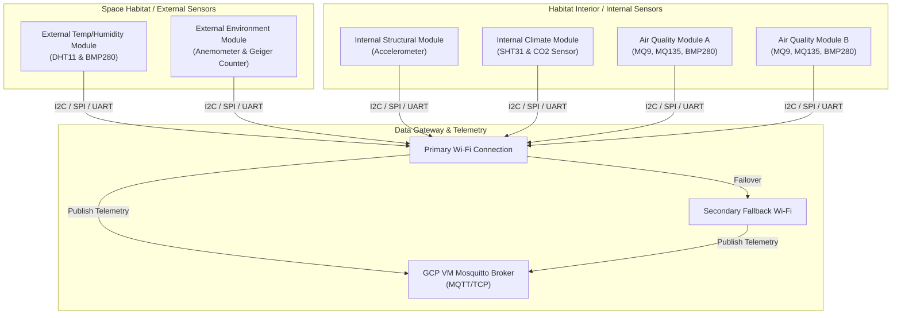

# Mission-Grade IoT Architecture

[](https://github.com/aditya-astron/Mission-Grade-IOT-Architecture/actions/workflows/cpp-lint.yml)
[](https://opensource.org/licenses/MIT)

A highly resilient, modular, multi-protocol embedded IoT system designed for real-time environmental monitoring in mission-simulated and analog space habitat environments. Engineered with non-blocking firmware architecture, multi-sensor failover strategies, and edge anomaly detection to guarantee **~95% system uptime** and **66% faster anomaly response times**.

---

## 🌌 System Architecture



---

## 🛠️ Hardware & Sensor Matrix

| Module | Primary Sensors | Communication Protocols | Key Parameters Monitored | Role |
| :--- | :--- | :--- | :--- | :--- |
| **External 1** | DHT11, BMP280 | I2C | Temperature, Humidity, Pressure | Ambient external climatology |
| **External 2** | Anemometer, Geiger Counter | UART / Pulse Counter | Wind speed, Radiation counts | Environmental safety and hazard tracking |
| **Internal 1** | Accelerometer (e.g. MPU6050) | I2C | G-force, Structural vibrations | Structural integrity monitoring |
| **Internal 2** | SHT31, CO2 Sensor | I2C | Humidity, Temp, Ambient CO2 | Life support environment assessment |
| **Internal 3 (A)** | MQ9, MQ135, BMP280 | I2C, Analog | AQI, CO, LPG, Smoke, Barometric Pressure | Cabin atmosphere quality check |
| **Internal B (B)**| MQ9, MQ135, BMP280 | I2C, Analog | AQI, Gas concentrations (Redundant) | Redundant cabin atmosphere safety module |

---

## 📦 Project Directory Structure

```text
Mission-Grade-IOT-Architecture/
├── .github/
│   └── workflows/
│       └── cpp-lint.yml           # CI C++ Code Formatting Action
├── src/
│   └── modules/
│       ├── external_anemometer_geiger/
│       │   ├── external_anemometer_geiger.ino
│       │   └── config.h.example
│       ├── external_temp_humidity/
│       │   ├── external_temp_humidity.ino
│       │   └── config.h.example
│       ├── internal_accelerometer/
│       │   ├── internal_accelerometer.ino
│       │   └── config.h.example
│       ├── internal_aqi_bmp280/
│       │   ├── internal_aqi_bmp280.ino
│       │   └── config.h.example
│       ├── internal_aqi_bmp280_mod2/
│       │   ├── internal_aqi_bmp280_mod2.ino
│       │   └── config.h.example
│       └── internal_humidity_temp_co2/
│           ├── internal_humidity_temp_co2.ino
│           └── config.h.example
├── .clang-format                  # Code style definition
├── .gitignore                     # Git rules (excludes local config.h files)
└── LICENSE                        # MIT License
```

---

## ⚙️ Firmware Configurations & Setup

To secure credential storage and avoid hardcoding secrets in firmware:

1. Navigate to the module folder you wish to deploy (e.g., `src/modules/external_temp_humidity/`).
2. Copy the `config.h.example` file to create a `config.h` file:
   ```bash
   cp config.h.example config.h
   ```
3. Open `config.h` and configure your credentials:
   ```cpp
   #define WIFI_SSID               "YOUR_WIFI_SSID"
   #define WIFI_PASSWORD           "YOUR_WIFI_PASSWORD"
   #define WIFI_SSID_FALLBACK      "YOUR_FALLBACK_WIFI_SSID"
   #define WIFI_PASSWORD_FALLBACK  "YOUR_FALLBACK_WIFI_PASSWORD"
   #define MQTT_SERVER             "YOUR_MQTT_BROKER_IP"
   ```
4. Flash the `.ino` file to your ESP32 or compatible MCU.

---

## 📈 Key Features

*   **Dual Wi-Fi Auto-Failover**: Implements primary and fallback WiFi logic to prevent offline periods during signal losses.
*   **Sensor Health Checks**: Proactively monitors connection states on I2C devices (like the BMP280) and auto-adapts logging rates if device disconnects are detected.
*   **Clean Separation of Credentials**: Keeps credentials completely modularized out of the code via `config.h` templates, enforcing security-first coding patterns.
